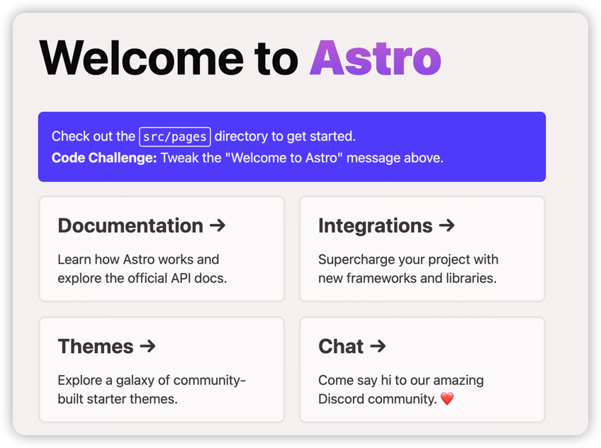

title: CMS-Astro-Intro
class: animation-fade
layout: true

<!-- This slide will serve as the base layout for all your slides -->
.bottom-bar[
  {{title}}
]

---

class: impact

# {{title}}
## Learning from Building

---

# Astro Installation

## Getting started - Installation

- ***installation***
```shell
npm create astro@latest
```
- ***in progress***
```shell
Welcome to Astro! (create-astro v1.0.1)
Lets walk through setting up your new Astro project.
✔ Where would you like to create your new project? … fluent-qatips
✔ Which template would you like to use? › Just the basics (recommended)
          ■■▶ Copying project files
```
---

## Run it

```shell
npm run dev
```

---
()
---
## What your want to Achieve? 
--


--- 

## How to Achieve with Astro

- Header
- Layout
  - Text
  - Subscribe
  - Statistic
- Latest Posts
- Favorite Posts
- Footer
---

## Build Header


